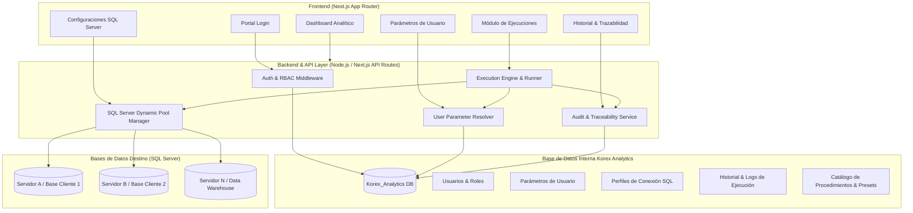

# ARQUITECTURA TÉCNICA - KOREX ANALYTICS

---

## 1. VISIÓN GENERAL

**Korex Analytics** está estructurado como una plataforma web modular, autónoma y desacoplada, orientada a la administración de usuarios, parametrización operativa, configuración multi-instancia de SQL Server y ejecución controlada de procedimientos analíticos con trazabilidad total.

---

## 2. DIAGRAMA DE ARQUITECTURA DEL SISTEMA

---

## 3. CAPAS DEL SISTEMA

### 3.1 Capa de Presentación (Frontend)
- **Tecnología**: Next.js (React 18/19), TypeScript, Tailwind CSS.
- **Identidad**: Tema centralizado basado en variables CSS (`--primary`, `--secondary`, etc.) con paleta de Azul Petróleo y Turquesa.
- **Componentes**: Renderizado responsivo, formularios validados, modales dinámicos y tablas con ordenamiento/filtrado avanzado.

### 3.2 Capa de Negocio y APIs (Backend)
- **API Routes**: Endpoints REST parametrizados bajo `/api/auth`, `/api/users`, `/api/parameters`, `/api/sqlserver`, `/api/executions`.
- **Validador de Ejecución**: Mapeo estricto de parámetros contra `sys.parameters` del SQL Server destino para evitar discrepancias de tipos.
- **Gestión Dinámica de Pools**: Creación y liberación eficiente de conexiones mediante `mssql.ConnectionPool`.

### 3.3 Capa de Datos Interna
- Base de datos independiente para almacenar metadatos de configuración, credenciales cifradas (AES-256), usuarios y logs de auditoría.

### 3.4 Capa de Conectividad Externa (Bases de Datos Destino)
- Conexión dinámica multi-servidor y multi-base gobernada por los perfiles de conexión seleccionados por el usuario ejecutor.
