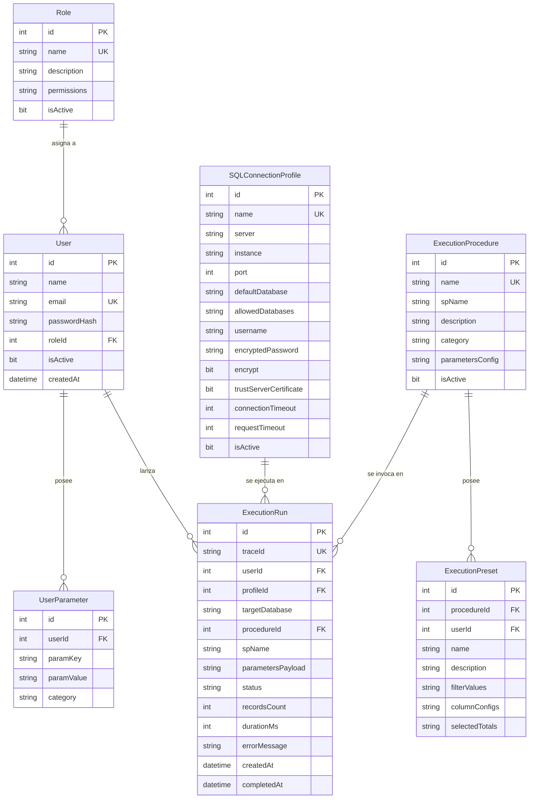

# MODELO DE BASE DE DATOS - KOREX ANALYTICS

---

## 1. ESQUEMA DDL INTERNO DE KOREX ANALYTICS

Korex Analytics cuenta con su propia base de datos dedicada (`Korex_Analytics` o equivalente configurado en su `.env`).

---

## 2. REGLAS DDL Y PRESERVACIÓN DE DATOS

1. **Integridad Referencial**: Uso estricto de PKs, FKs e índices únicos para prevenir inconsistencias.
2. **Índices de Rendimiento**:
   - `CREATE INDEX IX_ExecutionRun_User ON dbo.ExecutionRun(userId, createdAt DESC);`
   - `CREATE INDEX IX_ExecutionRun_Trace ON dbo.ExecutionRun(traceId);`
   - `CREATE INDEX IX_ExecutionRun_Status ON dbo.ExecutionRun(status);`
3. **Inmutabilidad y No Destrucción**: Queda estrictamente prohibido ejecutar `DROP DATABASE` o `TRUNCATE` en procesos automáticos.
