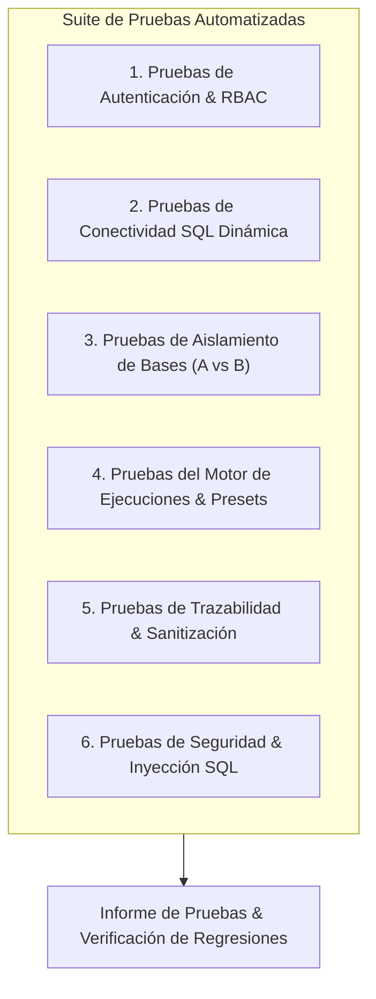

# PLAN Y PROTOCOLO DE PRUEBAS AUTOMATIZADAS - KOREX ANALYTICS

---

## 1. SUITE DE PRUEBAS AUTOMATIZADAS

Korex Analytics cuenta con un conjunto estructurado de pruebas unitarias, de integración, de seguridad y de no regresión.

---

## 2. DETALLE DE CAPAS DE PRUEBA

### 2.1 Autenticación y RBAC
- Login exitoso con credenciales válidas y generación de JWT.
- Rechazo de login con contraseña errónea o usuario inactivo.
- Bloqueo de endpoints protegidos ante peticiones sin sesión.
- Validación de que un usuario con rol `ANALYST` no pueda modificar perfiles de conexión SQL.

### 2.2 Conectividad SQL y Aislamiento (A vs B)
- Conexión exitosa contra servidor e instancia válidos.
- Manejo controlado de timeout cuando el servidor está inaccesible.
- Verificación estricta: Una ejecución configurada para `Servidor A / Base A` falla de inmediato si intenta invocar una base no autorizada `Base B`.

### 2.3 Ejecución de SPs y Sanitización
- Ejecución de Stored Procedure con parámetros completos.
- Validación de que parámetros inexistentes en `sys.parameters` se descarten antes de invocar el SP.
- Verificación de que las contraseñas nunca aparezcan en `ExecutionRun.parametersPayload`.
