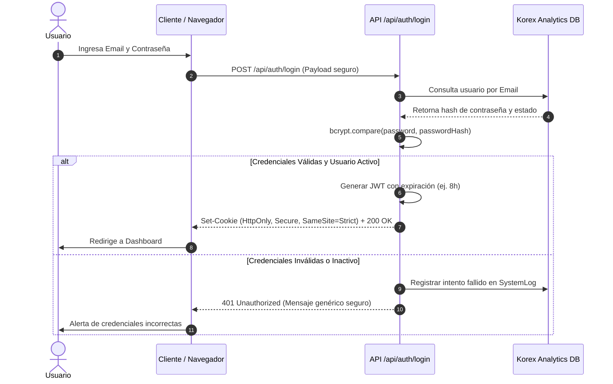

# POLÍTICA Y MODELO DE SEGURIDAD - KOREX ANALYTICS

---

## 1. PRINCIPIOS FUNDAMENTALES DE SEGURIDAD

1. **Defensa en Profundidad**: La seguridad opera en múltiples capas (Red, Aplicación, Base de Datos, Cifrado, Auditoría).
2. **Mínimo Privilegio**: Cada usuario y servicio opera con los permisos estrictamente necesarios para su rol.
3. **Validación en Backend**: Queda estrictamente prohibido confiar en la validación o visibilidad del frontend. Toda petición a una API valida sesión, rol y permisos en servidor.
4. **Secretos Fuera del Código**: Cero contraseñas hardcodeadas o volcadas en repositorios/logs.

---

## 2. AUTENTICACIÓN Y GESTIÓN DE SESIONES

---

## 3. AUTORIZACIÓN BASADA EN ROLES (RBAC)

Se definen 4 niveles estándar de roles:

| Rol | Alcance de Acceso | Acciones Permitidas |
|---|---|---|
| **SUPER_ADMIN** | Control Total del Sistema | Gestión de usuarios, perfiles SQL, parámetros, catálogos, auditoría y ejecución de cualquier SP. |
| **ADMIN** | Administración Operativa | Gestión de usuarios estándar, configuración de parámetros y ejecución de SPs autorizados. |
| **ANALYST** | Operación Analítica | Configuración de filtros, guardado de presets y ejecución de consultas/procedimientos analíticos. |
| **AUDITOR** | Supervisión y Lectura | Consulta de dashboard, historiales de ejecución, trazabilidad y logs de seguridad (sin permiso de ejecución). |

---

## 4. PROTECCIÓN DE CONEXIONES Y CIFRADO DE CREDENCIALES

1. **Cifrado AES-256-CBC**:
   - Toda contraseña de conexión a SQL Server se almacena cifrada bajo el formato `ENC(<iv>:<ciphertext>)`.
   - La clave maestra de cifrado reside en variables de entorno del servidor.
2. **Sanitización de Logs**:
   - Todo volcado de error a logs o trazabilidad enmascara datos sensibles: `password`, `token`, `secret`, `clave` → `***MASKED***`.
3. **Consultas Parametrizadas**:
   - Todo acceso a SQL Server utiliza `input()` tipado en el driver `mssql`, bloqueando cualquier vector de SQL Injection.
