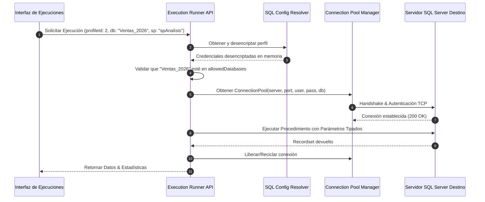

# GESTIÓN Y CONEXIÓN DINÁMICA SQL SERVER - KOREX ANALYTICS

---

## 1. OBJETIVO Y REGLA DE NO CONEXIONES HARDCODEADAS

Korex Analytics soporta la gestión de **Múltiples Perfiles de Conexión SQL Server**.

> [!CAUTION]
> **Prohibición Absoluta**: Queda terminantemente prohibido quemar o asumir nombres de servidores (`sa`, `localhost`, `Korex_pruebas`) en el código. Toda conexión se resuelve en caliente a partir del perfil seleccionado y validado.

---

## 2. ESTRUCTURA DE UN PERFIL DE CONEXIÓN (`SQLConnectionProfile`)

```typescript
interface SQLConnectionProfile {
    id: number;
    name: string;             // Ej: "Producción Norte", "DataWarehouse Central"
    server: string;           // Host o IP (ej: "192.168.1.50")
    instance?: string;        // Nombre de instancia opcional (ej: "SQLEXPRESS")
    port?: number;            // Puerto TCP (ej: 1433)
    defaultDatabase: string;  // Base de datos principal (ej: "Empresa_2026")
    allowedDatabases: string[]; // Lista blanca de bases accesibles
    username: string;         // Usuario SQL Server
    encryptedPassword: string;// Contraseña cifrada AES-256
    encrypt: boolean;         // SSL/TLS Encryption
    trustServerCertificate: boolean;
    connectionTimeout: number;// Segundos para timeout de conexión (default: 15)
    requestTimeout: number;   // Segundos para timeout de query/SP (default: 180)
    isActive: boolean;
}
```

---

## 3. FLUJO DE CONEXIÓN Y RESOLUCIÓN DINÁMICA



---

## 4. VALIDACIÓN PREVENTIVA DE AISLAMIENTO (PRUEBA A vs B)

El sistema garantiza que una ejecución programada para la **Configuración A (Base A)** nunca pueda dispararse sobre la **Configuración B (Base B)**:
1. El backend compara explícitamente el `targetDatabase` solicitado contra el catálogo del `profileId`.
2. Se ejecuta un `USE [TargetDatabase]` validado o se abre el pool apuntando estrictamente a dicha base.
3. Se verifica `SELECT DB_NAME()` en la sesión antes de invocar el SP.
