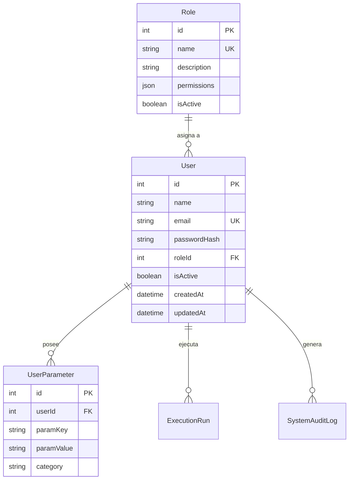

# GESTIÓN DE USUARIOS Y ROLES - KOREX ANALYTICS

---

## 1. MODELO DE DATOS DE USUARIOS

---

## 2. CICLO DE VIDA DEL USUARIO

1. **Creación**:
   - Registro mediante formulario administrativo o siembra inicial.
   - Validación de unicidad de correo y complejidad de contraseña (mínimo 8 caracteres, alfanumérico).
   - Generación de hash seguro con `bcryptjs`.
2. **Asignación de Roles y Parámetros**:
   - Asignación obligatoria de un `RoleId`.
   - Inicialización de parámetros por defecto del usuario (servidor preferido, base de datos habitual, filtros por defecto).
3. **Modificación / Cambio de Contraseña**:
   - Endpoint `/api/users/update` y `/api/users/change-password` protegidos con validación de contraseña actual para usuarios estándar o permiso administrativo para SuperAdmin.
4. **Activación / Desactivación (Baja Lógica)**:
   - Los usuarios nunca se eliminan físicamente si poseen histórico de ejecuciones o logs asociados (`isActive = false`), preservando la integridad referencial.
